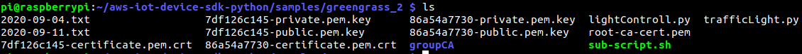

## Setting subscriber pada Greengrass Core (raspi)

```Note : Harus lakuin step pada modul1, modul2 dan modul3 dulu```

Setting pada IoT Core
1. Pertama masuk ke [AWS Management Console](https://console.aws.amazon.com/), lalu buka IoT Core. Selanjutnya buka:

	```
	Greengrass -> Group -> pilih group -> Devices -> Add Device -> Create new device
	```

2. Ketik name untuk device (ex. Raspberry Pi), klik <b>Next</b>

3. Pada halaman <b>Set up security</b>, klik <b>Use Defaults</b>

4. Pada halaman <b>Download security credentials</b>, klik <b>Download these resources as a tar.gz</b>

5. Pindahkan file yang didownload tadi ke raspi dengan perintah <b>scp</b>:

	```
	$ cd /tempat-file-berada (ex. cd ~/Downloads) 
	$ scp {hash}-setup.tar.gz pi@ip-address:/direktori-file
	```

6. Setting terlebih dahulu <b>subscriptions</b> agar antar device saling terhubung
<b>Note : ESP32 dan raspi adalah thingnamenya</b>

	```
	ESP32 (freertos) -> Local Shadow Service (topic = $aws/things/thingname-raspi/shadow/update)
	raspi (greengrass) -> Local Shadow Service  (topic = $aws/things/thingname-raspi/shadow/update) 
	Local Shadow Service -> ESP32 (freertos) (topic = $aws/things/thingname-raspi/shadow/update/accepted)
	Local Shadow Service -> ESP32 (freertos) (topic = $aws/things/thingname-raspi/shadow/update/rejected)
	Local Shadow Service -> Raspi (greengrass) (topic = $aws/things/thingname-raspi/shadow/update/rejected)
	Local Shadow Service -> Raspi (greengrass) (topic = $aws/things/thingname-raspi/shadow/update/accepted)
	Local Shadow Service -> Raspi (greengrass) (topic = $aws/things/thingname-raspi/shadow/update/delta)
	```

7. Pada halaman <b>group configuration page</b>, klik <b>Actions</b>, lalu klik <b>Deploy</b>

8. Download [AWS IoT Device SDK for Python](https://github.com/aws/aws-iot-device-sdk-python) pada raspi, ekstrak dan install program konfigurasinya

	```
	$ wget https://github.com/aws/aws-iot-device-sdk-python
	$ unzip aws-iot-device-sdk-python.zip
	$ cd aws-iot-device-sdk-python
	$ sudo python setup.py install 
	```

9. Download program subscriber pada raspi di [Subscriber-Raspi](https://github.com/aws/aws-greengrass-core-sdk-python/blob/master/examples/TrafficLight/trafficLight.py), dan pindahkan ke folder ```aws-iot-device-sdk-python/samples/greengrass```

	```
	$ wget https://github.com/aws/aws-greengrass-core-sdk-python/blob/master/examples/TrafficLight/trafficLight.py
	$ cp trafficLight.py ~/aws-iot-device-sdk-python/samples/greengrass
	```

10. Pindahkan file sertifikat yang dilakukan pada langkah 5 ke folder ```aws-iot-device-sdk-python/samples/greengrass``` lalu ekstrak, kemudian download root-ca-cert.pem

	```
	$ cp {hash}-setup.tar.gz ~/aws-iot-device-sdk-python/samples/greengrass
	$ cd ~/aws-iot-device-sdk-python/samples/greengrass
	$ tar -xzvf {hash}-setup.tar.gz
	$ wget -O root-ca-cert.pem https://www.amazontrust.com/repository/AmazonRootCA1.pem
	```
  	
11. Jalankan script ```trafficLight.py``` agar dapat subscribe data dari esp32 (freertos)
<b>Note : melihat endpoitnya di AWS Console -> IoT Core -> Test -> View endpoint</b>  

	```
	$ python trafficLight.py --endpoint axkpps0upkdjx-ats.iot.us-east-2.amazonaws.com --rootCA root-ca-cert.pem --cert {hash}-certificate.pem.crt --key {hash}-private.pem.key --thingName thingname-raspi --clientId thingname-raspi
	```
