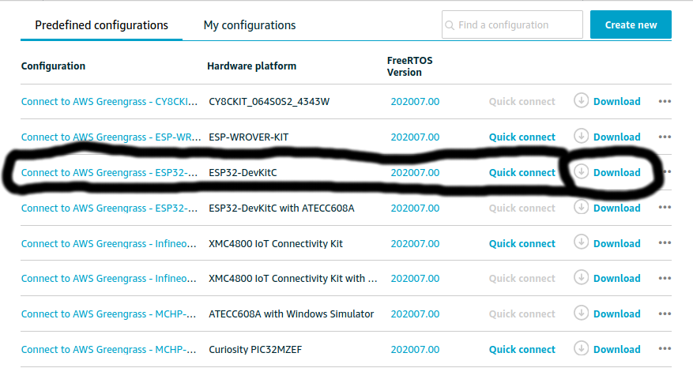

## Kofigurasi amazon freertos pada ESP32 WROOM32
<b>Note:</b>
- <b>harus setting permission terlebih dahulu di [IAM user](https://docs.aws.amazon.com/IAM/latest/UserGuide/) yaitu ```AmazonFreeRTOSFullAccess``` dan ```AWSIoTFullAccess```, lalu harus melakukan langkah langkah pada modul 1-4</b>
- <b>Device yang digunakan yaitu ESP32-DevKitC</b>

1. Konfigurasi Espressif Hardware di [Setting Espressif Hardware](https://docs.espressif.com/projects/esp-idf/en/latest/esp32/get-started/index.html#step-1-install-prerequisites), lakukan semua instruksinya

2. Install toolchain terlebih dahulu di [Toolchain Linux](https://docs.espressif.com/projects/esp-idf/en/v3.3/get-started-cmake/linux-setup.html), lakukan semua instruksinya

3. Buka link [freeRTOS Console](https://console.aws.amazon.com/freertos), lalu download file freertosnya

  	

4. Install AWS CLI terlebih dahulu, lalu konfigurasi AWS CLI dengan memasukkan AWS access key ID, secret access key, and default region name. Contoh dapat dilihat di [Konfigurasi AWS CLI](https://docs.aws.amazon.com/cli/latest/userguide/cli-chap-getting-started.html)

	<b>Note: kalau pake akun IAM minta AWS access key ID, secret access key, and default region name sama yang megang akun utama(superuser)</b>

	```
	$ sudo apt-get install aws-cli
	$ aws configure
	```

5. Install dependensi untuk menjalankan setup freertos

	```
	$ pip install tornado nose --user
	$ pip install boto3 --user 
	```

6. Setelah itu ekstrak file yang telah didownload pada langkah 4, lalu masuk ke folder ```connect-to-aws-greengrass-esp32-devkitc/freertos/tools/aws_config_quick_start/```:

	```
	$ unzip connect-to-aws-greengrass-esp32-devkitc.zip
	$ cd connect-to-aws-greengrass-esp32-devkitc/freertos/tools/aws_config_quick_start/
	```

7. Edit file ```configure.json``` dengan text editor, lalu simpan 

	```
	{
    	"afr_source_dir":"../..",
    	"thing_name":"thingname-esp32(freertos)",
    	"wifi_ssid":"id-wifi",
    	"wifi_password":"pass-wifi",
    	"wifi_security":"eWiFiSecurityWPA2"
	}	 
	```

8. Jalankan program ```SetupAWS.py```

	```
	$ python SetupAWS.py setup
	Note: program ini melakukan
	- Buat secara otomatis IoT thing, certificate, and policy
	- Menyambungkan secara otomatis IoT policy -> certificate and certificate -> AWS IoT thing
	- setup secara otomatis aws_clientcredential.h file dengan AWS IoT endpoint, Wi-Fi SSID, dan credentials
	- Format secara otomatis certificate dan private key, secara otomatis langsung nulis di dalam file aws_clientcredential.h
	```
